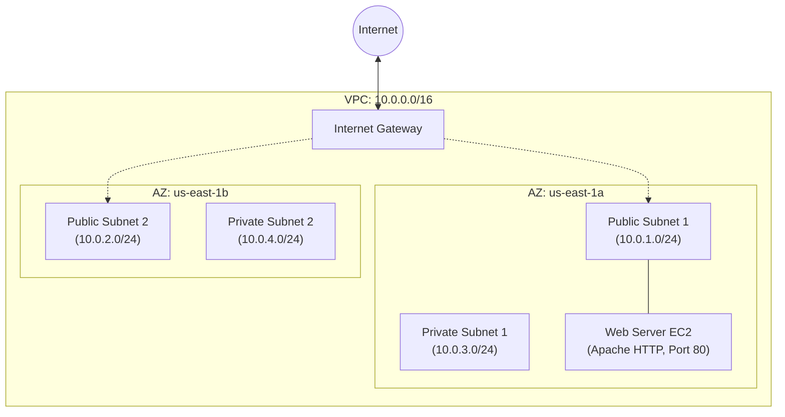

# Domain 1: Design Secure Architectures - Network for a Web Application

## Overview
This repository contains the first practical exercise for the **AWS Certified Solutions Architect - Associate** certification, specifically focusing on **Domain 1: Design Secure Architectures**.

The goal of this lab is to design and implement a secure, highly available network foundation (VPC) and deploy a web application into a public subnet.

## Architecture Diagram



## Architecture Highlights
- **1 Virtual Private Cloud (VPC)** with a `10.0.0.0/16` CIDR block.
- **4 Subnets** across **2 Availability Zones (AZs)** for High Availability (2 Public, 2 Private).
- **Public Route Table** and **Internet Gateway (IGW)** to provide internet access to public subnets.
- **Security Group** restricting inbound traffic to HTTP (Port 80) only and allowing all outbound traffic.
- **Amazon EC2 Instance** acting as a web server, bootstrapped via User Data to automatically install and start Apache HTTP Server.

## Project Structure
- `terraform/`: Contains the declarative Infrastructure as Code (IaC) configuration.
- `scripts/`: Contains imperative shell scripts to deploy and destroy the infrastructure using AWS CLI.

## How to Deploy

### Option 1: Using Terraform (Recommended)
This method uses Infrastructure as Code, making the deployment reproducible and version-controlled.

1. Navigate to the terraform directory:
   ```bash
   cd terraform
   ```
2. Initialize, plan, and apply the configuration:
   ```bash
   terraform init
   terraform plan
   terraform apply --auto-approve
   ```
3. After applying, Terraform will output the public IP of the EC2 instance. Wait a minute for the bootstrap script to finish, and try accessing the IP in your browser!

To destroy:
```bash
terraform destroy --auto-approve
```

### Option 2: Using AWS CLI (Imperative approach)
This method executes AWS CLI commands step-by-step to build the infrastructure.

1. Navigate to the scripts directory:
   ```bash
   cd scripts
   ```
2. Run the deployment script:
   ```bash
   bash deploy.sh
   ```
3. To clean up the resources created by the CLI script, run the destroy script:
   ```bash
   bash destroy.sh
   ```
