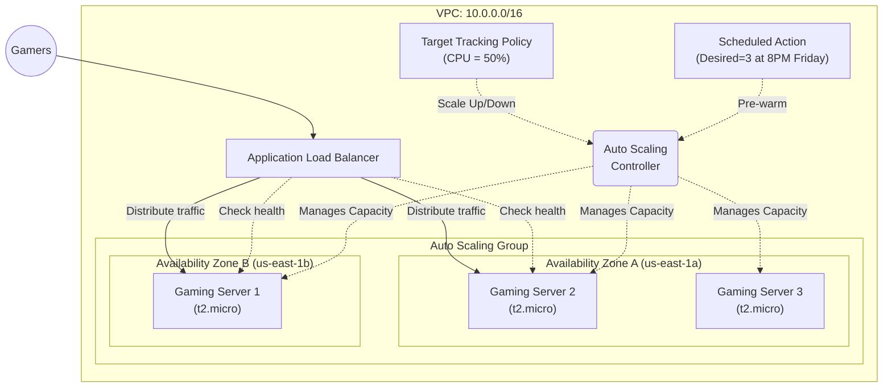

# Domain 1: Design Secure Architectures - Implementing Elasticity

## Overview
This is the second practical exercise for the **AWS Certified Solutions Architect - Associate** certification. This scenario covers **Implementing Elasticity** simulating a Gaming Server environment.

The goal of this lab is to use Amazon EC2 features to meet both predictable and unpredictable demand changes. We will replace unhealthy servers and automatically scale horizontally to maintain capacity in two Availability Zones.

## Architecture Diagram (Gaming Servers)



## Architecture Highlights
- **Application Load Balancer (ALB)**: Distributes inbound HTTP traffic from gamers across healthy gaming servers.
- **Launch Template**: Defines the blueprint for our gaming servers (AMI, Instance Type, Security Groups, and Bootstrap User Data).
- **Auto Scaling Group (ASG)**: Maintains a minimum and desired capacity of 2 instances spread across 2 Availability Zones.
- **Target Tracking Scaling Policy**: Automatically adds new servers if the average CPU utilization exceeds **50%**, ensuring the game stays responsive under load.
- **Scheduled Actions**: Includes a DIY Goal to preemptively scale the desired capacity to 3 instances every Friday at 8:00 PM UTC to handle weekend gamer traffic surges.

## Security Rule Applied
The Security Group assigned to the EC2 Instances **only accepts traffic from the Application Load Balancer**. It blocks all direct internet access on port 80, enforcing that all traffic must go through the ALB.

## How to Deploy

### Option 1: Using AWS CLI (Imperative)
This method executes AWS CLI commands step-by-step to build the infrastructure, providing deep insight into how each component interacts.

1. Navigate to the scripts directory:
   ```bash
   cd scripts
   ```
2. Run the deployment script:
   ```bash
   bash deploy.sh
   ```
3. To cleanly terminate all resources avoiding dependency errors, run:
   ```bash
   bash destroy.sh
   ```

### Option 2: Using Terraform (Declarative)

We've modularized the infrastructure using **Terraform** best practices:
- `providers.tf`: AWS provider configuration
- `variables.tf`: Input variables
- `main.tf`: VPC, Subnets, Internet Gateway, and Security Groups
- `launch_template.tf`: EC2 blueprints and User Data config
- `alb.tf`: Load Balancer, Target Group, and Listeners
- `asg.tf`: Auto Scaling Group, CPU Tracking, and Scheduled Actions

1. Navigate to the terraform directory:
   ```bash
   cd terraform
   ```
2. Initialize, plan, and apply the configuration:
   ```bash
   terraform init
   terraform plan
   terraform apply --auto-approve
   ```
3. Look for the `alb_dns_name` in the outputs and open it in your browser. You will see which specific gaming server (Instance ID / AZ) responded to your request!

To destroy the lab cleanly:
```bash
terraform destroy --auto-approve
```
