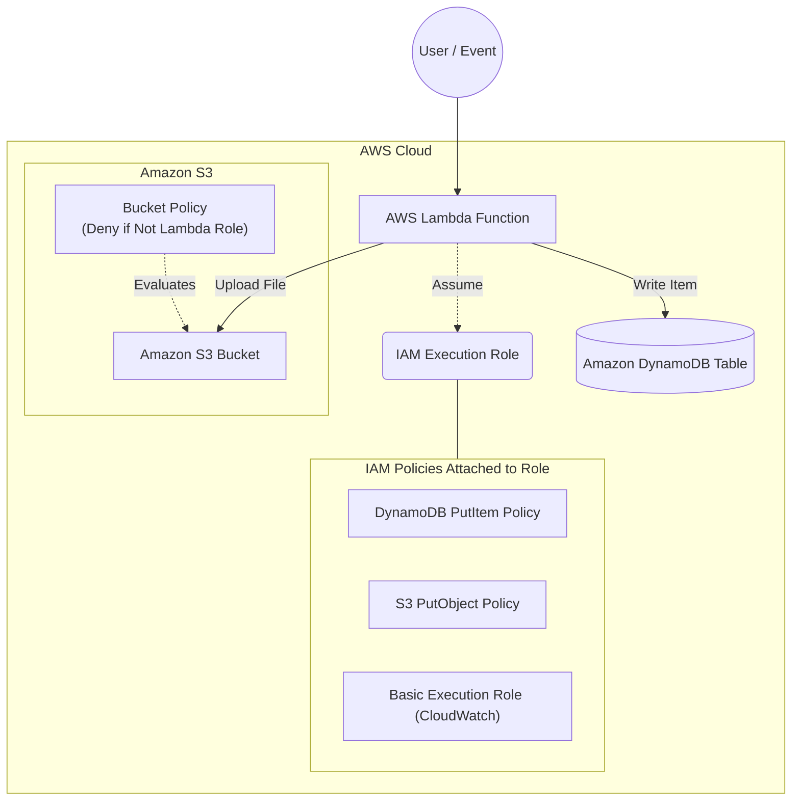

# Domain 3: Design High-Performing Architectures - Permissions for a Serverless Application

## Overview
This is the third practical exercise for the **AWS Certified Solutions Architect - Associate** certification. This scenario covers **IAM Roles, Resource Policies, and Least Privilege** by simulating permissions within a serverless microservice.

The goal of this lab is to create a secure AWS Lambda function and strictly control its access to other AWS services like Amazon S3 and Amazon DynamoDB using IAM Roles and S3 Bucket Policies.

## Architecture Diagram (Serverless Data Processing)



## Architecture Highlights
- **AWS Lambda Function**: Executes Python code to process data, write an item to DynamoDB, and upload a file to S3.
- **IAM Execution Role**: An identity that the Lambda function assumes to gain permission to interact with other AWS services.
- **Custom IAM Policies**: Instead of using broad managed policies, we crafted highly specific, least-privilege policies that only allow `dynamodb:PutItem` on the specific table and `s3:PutObject` on the specific bucket.
- **Amazon S3**: Object storage used to store the output of the Lambda function.
- **Amazon DynamoDB**: NoSQL database used to store record items generated by the Lambda function.

## Security Rule Applied
To practice defense-in-depth, we apply an **S3 Bucket Policy** that acts as a secure perimeter. The policy explicitly **Denies (`Effect: Deny`)** any `s3:PutObject` action to the bucket if the requester's Principal ARN **DOES NOT MATCH (`StringNotEquals`)** the ARN of our specific Lambda Execution Role. 

Even if another user or service is granted an IAM policy allowing them to write to the bucket, the bucket policy will forcefully deny them.

## How to Deploy

### Option 1: Using AWS CLI (Imperative)
This method executes AWS CLI commands step-by-step to build the infrastructure, providing deep insight into how each component interacts.

1. Navigate to the scripts directory:
   ```bash
   cd scripts
   ```
2. Run the deployment script:
   ```bash
   bash deploy.sh
   ```
3. To cleanly terminate all resources avoiding dependency errors, run:
   ```bash
   bash destroy.sh
   ```

### Option 2: Using Terraform (Declarative)

We've modularized the infrastructure using **Terraform** best practices:
- `providers.tf`: AWS provider configuration
- `variables.tf`: Input variables
- `main.tf`: Lambda, IAM Roles, IAM Policies, S3, and DynamoDB provisioning.
- `data.tf`: AWS Caller Identity Data Source
- `src/main.py`: The Python application logic for the Lambda function.

1. Navigate to the terraform directory:
   ```bash
   cd terraform
   ```
2. Initialize, plan, and apply the configuration:
   ```bash
   terraform init
   terraform plan
   terraform apply --auto-approve
   ```
3. Check the outputs to see the result of the Lambda invocation payload!

To destroy the lab cleanly:
```bash
terraform destroy --auto-approve
```
