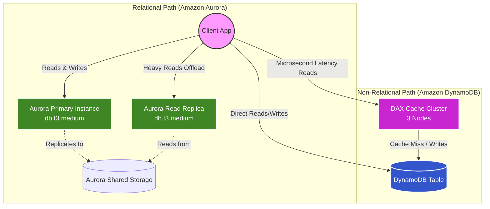

# Domain 4: Design Cost-Optimized Architectures - Comparing Databases: Amazon Aurora and Amazon DynamoDB

This exercise is part of the AWS Solutions Architect Associate learning journey. It demonstrates how to provision, configure, and scale two of AWS's most popular managed database solutions: **Amazon Aurora** (Relational) and **Amazon DynamoDB** (Non-relational). 

## 🏗️ Architecture / Objective

In this hands-on lab, the primary objectives are to:
1. **Create a Relational Database** using an Amazon Aurora (MySQL compatible) cluster.
2. **Scale Relational Reads** by deploying an Aurora Read Replica to offload the primary read workload.
3. **Create a Non-Relational Database** using Amazon DynamoDB.
4. **Achieve Microsecond Latency** by deploying a DynamoDB Accelerator (DAX) cluster caching layer in front of the DynamoDB table.

### Architecture Diagram (Comparing Database Scaling)



## 🚀 Deployment Options

You have two different ways to deploy this exercise depending on your preference. Both methods will build the exact same architecture, including the underlying prerequisite networking rules and IAM roles.

---

### Option 1: AWS CLI (Shell Scripts)
The `scripts/` directory contains functional bash scripts executing sequential AWS CLI commands. This represents an imperative way of managing cloud resources.

**To Deploy:**
```bash
cd scripts
chmod +x deploy.sh
./deploy.sh
```

**To Destroy:**
```bash
cd scripts
chmod +x destroy.sh
./destroy.sh
```
> **Note:** The `destroy.sh` contains built-in "waiters" and dependency catchers ensuring that AWS services like DAX and RDS clusters do not block the security groups from being deleted during teardown.

---

### Option 2: Infrastructure as Code (Terraform)
The `terraform/` directory contains the identical architecture translated into Declarative HCL (HashiCorp Configuration Language). The configurations are dynamically parameterized inside `variables.tf`.

**To Deploy:**
```bash
cd terraform
terraform init
terraform apply
```

**To Destroy:**
```bash
cd terraform
terraform destroy
```

## 📚 Resources Provisioned
* Both approaches automatically detect your **Default VPC** and Subnets.
* **IAM Role:** `ComunidadDevopsDAXServiceRole` with AmazonDynamoDBFullAccess policy.
* **Security Group:** Opens TCP Port 8111 for DAX cluster unencrypted traffic.
* **DAX Cluster:** `dax.t3.small` 3-node in-memory cache replica ring. 
* **DynamoDB Table:** `MyDynamoDBTable`, simple primary `ID` key with 5 Read/5 Write provisioned capacity.
* **Aurora Cluster:** MySQL-8.0 compatible relational database encompassing `db.t3.medium` Multi-AZ instances (Primary + Read Replica).
